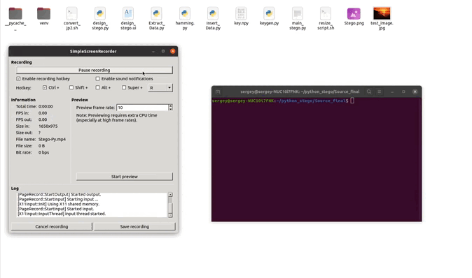

<p align="center">
  <a href="https://github.com/SergeyIvanovDevelop/Stego-Py">
    
  </a>
</p>
<h1 align="center">
  Stego-Py
</h1>

## Stego-Py &middot; [](./LICENSE) [](https://www.python.org/) [](https://pypi.org/project/PyQt5/) [](https://www.linkedin.com/in/sergey-ivanov-33413823a/) [](https://t.me/SergeyIvanov_dev) ##

This repository contains the code for a project designed to embed/extract text stegs into still images via wavelet transforms (coefficient changes). The wavelet transform is currently the least noticeable method of information embedding from the point of view of steganalysis, since the embedding occurs in the wavelet coefficients of the compressed image, and when the image is restored, the embedded information is "smeared" over the image (information embedding in the frequency domain). This allows the image to be more robust to affine transformations (squeezing, stretching the image, etc.).

The project is implemented as a `GUI` application `PyQt5`, which allows you to manually set the level of decomposition of wavelet transforms and select the output image format (JPEG2000 format is recommended, because it is based on a compression method based on wavelet transforms, which makes images of this format more resistant to various types of influences on it_).

Rules for embedding information (in which coefficients the embedding will take place is determined by the key file `key.npy`, which can be generated using the `Python` script `keygen.py`).

## :computer: Getting Started  ##

**Step 1**

1. Go to home directory and clone repository from github: `cd ~ && git clone https://SergeyIvanovDevelop@github.com/SergeyIvanovDevelop/Stego-Py`

**Step 2**<br>

2. Go to the directory of the downloaded repository: `cd ~/Stego-Py`

**Step 3**<br>

3. Installing dependencies:

```
sudo apt-get install python3-pip
pip3 install PyQt5
pip3 install opencv-python==4.1.2.30
pip3 install scipy
```

**Step 4**<br>

4. Run application: `python3 main_stego.py`


**:clapper: Example using (GIF):**<br>

This animation demonstrates scenarios for using the Stego-Py.<br>

<p align="center">
  
</p>

### :bookmark_tabs: Licence ###
Stego-Py is [CC BY-NC-SA 3.0 licensed](./LICENSE).
